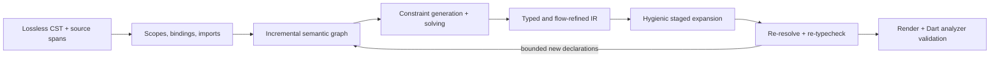

# dmx — Semantic Front End and Static Metaprogramming

Part of the [dmx implementation plan](PLAN.md).

## [semantic-expansion] Semantic Front End and Static Metaprogramming

### [semantic-expansion.intent] Intent and current status

**None of this plan is implemented yet.** v0.3 has a lossless tree-sitter CST, parsed declarations, a name-level index, and a Rust context builder. It does not have a project-wide binding graph, expression type inference, flow analysis, typed quotations, staged expansion, or user-defined type judgments.

That is the starting point, not the destination. **The intended end state is a full-fledged static metaprogramming system, not a syntax helper.** dmx will build compiler-grade semantic understanding on top of its AST/CST work and use it for deep, type-directed static metaprogramming. The goal is not a larger catalogue of syntax node names. A macro should eventually be able to ask what a reference binds to, which instantiated member is selected, what type an expression synthesizes, which constraints justify that type, and how generated declarations change later semantic passes.

The final output remains ordinary Dart and MUST pass the Dart analyzer. dmx cannot redefine Dart's type soundness from outside the compiler. "Extending into the type system" therefore means sound elaboration: project-defined static judgments, typed DSLs, type-directed derivation, and generated evidence lower into analyzer-valid Dart with precise diagnostics and provenance.

### [semantic-expansion.architecture] Intended architecture

The CST remains authoritative for bytes, comments, recovery, exact spans, and inline emission. Semantic facts decorate stable syntax and declaration identities; they MUST NOT be smuggled into display strings or inferred from node-kind names. This follows the extensible-tree direction studied in *Trees That Grow*: syntax representations must accept later decorations without cloning the entire tree for each compiler phase.[^trees-that-grow]

### [semantic-expansion.invariants] Design invariants

- **Syntax and semantics remain distinct.** CST nodes preserve source; immutable semantic records hold resolved identities, types, constraints, flow facts, and evidence.
- **Every fact is explainable.** A resolved or inferred fact carries its origin, dependencies, and derivation; an unavailable fact carries a typed unknown reason. `dmx explain` exposes both.
- **Binding precedes typing.** Scope identity and reference resolution are first-class. Macro hygiene is based on binding identity and scope sets, not spelling tricks or post-hoc renaming.[^scope-sets]
- **Rules precede algorithms.** Specify declarative typing and elaboration judgments, then implement and test the solver against them. The inference engine and Dart-specific constraint domain remain separable, following the modular stratification demonstrated by OutsideIn(X).[^outside-in]
- **Checking and synthesis cooperate.** Use bidirectional typing where annotations or expected types are available, rather than demanding global inference for every construct. This keeps rich systems implementable and improves the locality of errors.[^bidirectional]
- **Expansion has phases.** Macro code, quoted code, generated bindings, and runtime Dart occupy explicit stages. Cross-stage references require declared persistence rules; there is no ambient capture.
- **Expansion is bounded and deterministic.** Generated declarations may re-enter binding and typing only through an explicit dependency graph with cycle diagnostics and a deterministic fixed-point/fuel rule.
- **Validation remains the backstop, not the type system.** Full-file parsing and `dart analyze --fatal-infos` still gate emission, but semantic errors should be rejected earlier at their originating macro or judgment.

### [semantic-expansion.capabilities] Target capabilities

The semantic model is complete enough only when it can represent and query behavior, not merely enumerate syntax:

- lexical and library scopes, imports/exports, prefixes, shadowing, declaration identity, and reference binding;
- classes, mixins, extensions, inheritance, overrides, aliases, nullability, generic bounds and substitutions, instantiated members, and operator/member selection;
- expression and initializer types, contextual checking, patterns, promotions, reachability, and flow-sensitive refinements;
- the constraints and evidence behind a result, including equality, subtyping/assignability, bounds, overload/member selection, and explicit ambiguity;
- semantic dependencies fine-grained enough to invalidate only affected declarations and macro expansions;
- typed quotations and splices whose free variables, stage, expected type, and introduced bindings are checked before rendering;
- type-directed generation across declarations, including derived implementations selected from resolved interfaces and generic obligations;
- project-defined static judgments and typed DSL forms that validate and elaborate into ordinary Dart instead of merely printing text.

The last two items are the decisive step from syntax-aware code generation to deep static metaprogramming. MacroML shows why generative binding macros need an explicit multi-stage semantics to be both type- and stage-safe.[^macroml] Turnstile demonstrates the stronger destination: macro rules can type-check a surface language and elaborate it into a target language, with modular type-system rules rather than a hard-coded list of AST cases.[^type-systems-as-macros]

### [semantic-expansion.delivery] Delivery sequence

- [ ] **S0 — Semantic contract:** write the Dart subset's declarative binding, typing, promotion, and elaboration judgments; version the semantic schema; define `Unknown` and evidence forms.
- [ ] **S1 — Binding graph:** replace name-only lookup with stable declaration identities, lexical scopes, library namespaces, imports/exports, inheritance edges, and provenance-preserving diagnostics.
- [ ] **S2 — Type core:** implement type representation, normalization, substitution, assignability/subtyping, generic bounds, constraint generation/solving, and bidirectional expression typing.
- [ ] **S3 — Dart semantics:** add member resolution, constructors, extensions, mixins, overrides, nullability, patterns, flow promotion, constant contexts, and the remaining language-specific rules required by the corpus.
- [ ] **S4 — Typed macro API:** expose immutable semantic queries, type/evidence values, typed unknowns, and dependency registration to built-ins and Dart macro workers without leaking analyzer objects across the protocol.
- [ ] **S5 — Staged expansion:** add hygienic typed quote/splice IR, generated-binding identity, phase checking, deterministic expansion/re-analysis, and cycle/fuel diagnostics.
- [ ] **S6 — Type-system elaboration:** define an opt-in API for project-owned static judgments and typed DSLs that elaborate to standard Dart; prove the boundary with non-trivial end-to-end examples.

Each stage MUST be useful independently. Shipping S1 does not imply type inference; shipping S2 does not imply full Dart analyzer parity; shipping typed queries does not imply typed staged expansion. Capability negotiation and diagnostics MUST report the exact implemented semantic level.

### [semantic-expansion.validation] Research and acceptance gates

- Differentially compare binding identities, inferred types, promotions, selected members, and diagnostics with a pinned Dart analyzer oracle over the golden and package corpus. Differences require an explicit compatibility decision; they are never normalized away as strings.
- Property-test substitution, alpha-equivalence, scope preservation, constraint normalization, and incremental invalidation. Recomputing from a clean graph MUST equal incremental results.
- Add black-box E2E cases for cross-library generics, extension selection, promotions through patterns, generated bindings, nested expansion, ambiguity, cycles, and invalid typed splices.
- Require every accepted expansion to preserve binding hygiene, stage correctness, and analyzer validity. A failed expansion leaves handwritten source and the last valid generated output untouched.
- Benchmark parse, bind, solve, expand, and recheck separately. Cache keys include every semantic dependency and rule/schema version; no numeric performance claim ships without the reproducible corpus.

The cited systems are design evidence, not code to copy and not claims that Dart shares Haskell, ML, or Racket semantics. dmx must state its own Dart judgments and validate them against Dart. The papers establish proven architectural patterns: extensible decorated trees, stratified constraint solving, local bidirectional checking, scope-based hygiene, explicit staging, and typed elaboration.

[^trees-that-grow]: Shayan Najd and Simon Peyton Jones, [*Trees That Grow*](https://arxiv.org/abs/1610.04799), Journal of Universal Computer Science 23(1), 2017.
[^scope-sets]: Matthew Flatt, [*Binding as Sets of Scopes*](https://users.cs.utah.edu/plt/scope-sets/), POPL 2016.
[^outside-in]: Dimitrios Vytiniotis, Simon Peyton Jones, Tom Schrijvers, and Martin Sulzmann, [*OutsideIn(X): Modular Type Inference with Local Assumptions*](https://simon.peytonjones.org/outsideinx/), Journal of Functional Programming 21(4–5), 2011.
[^bidirectional]: Jana Dunfield and Neelakantan R. Krishnaswami, [*Complete and Easy Bidirectional Typechecking for Higher-Rank Polymorphism*](https://arxiv.org/abs/1306.6032), ICFP 2013.
[^macroml]: Steven E. Ganz, Amr Sabry, and Walid Taha, [*Macros as Multi-Stage Computations: Type-Safe, Generative, Binding Macros in MacroML*](https://www.cs.rice.edu/CS/PLT/Publications/MetaMixGen/icfp01a.pdf), ICFP 2001.
[^type-systems-as-macros]: Stephen Chang, Alex Knauth, and Ben Greenman, [*Type Systems as Macros*](https://stchang.github.io/popl2017/index.html), POPL 2017.
