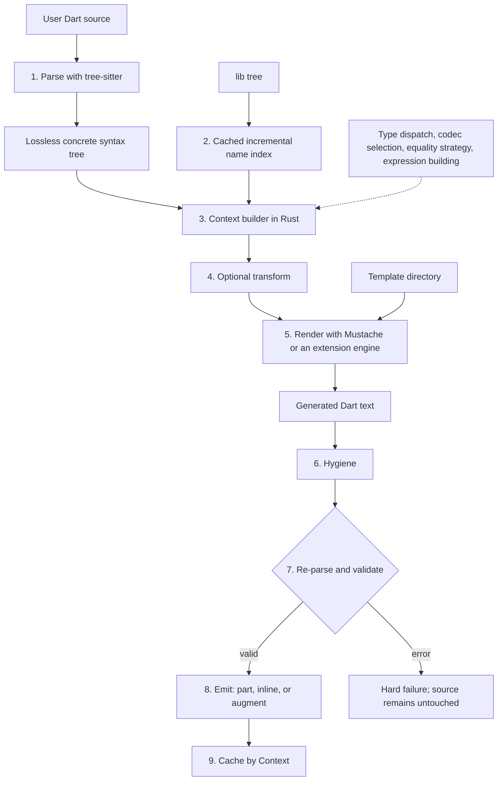

# dmx — Architecture

Part of the [dmx specification](SPEC.md).

## [architecture] Architecture

Stages MUST be pure functions of their declared inputs: no clock, no network, no ambient environment. Stages 4 and 5 may run in an external process ([extensions.worker-protocol]) but inherit the same obligation. This is what makes G4 and [execution] caching sound.

Critically, **stages 6–8 are unconditional**. No matter which language produced the text in stage 5, it is hygienized, re-parsed, and rejected if malformed. Extension authors cannot bypass the safety pipeline.

[typediagram] is a built-in macro with a second source path into the same pipeline. For a `*.dmx.md` input, native Rust CommonMark and typeDiagram parsing synthesize the macro invocation in stages 1–3; the bound Markdown Mustache fence supplies stage 5. The path uses the same macro registry and rejoins before hygiene, validation, emission, and caching, so Markdown-authored models receive the same generated-Dart safety guarantees as annotation-authored models.

This diagram specifies the v0.3 pipeline, not its architectural ceiling. The `tree-sitter` CST is the lossless syntax and provenance layer on which [semantic-expansion] intends to add scope and binding resolution, a project semantic graph, constraint solving, inferred types, and typed staged expansion. Those layers do not exist yet. They MUST refine the existing parse → context boundary rather than discard CST fidelity or weaken final full-file validation.

---
