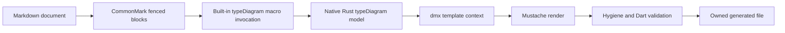

# dmx — typeDiagram Markdown Macro

Part of the [dmx specification](SPEC.md).

## [typediagram] typeDiagram Definitions plus Mustache Templates

dmx MUST generate Dart model source from typeDiagram definitions embedded in Markdown and user-authored Mustache templates:



[typeDiagram](https://typediagram.dev/docs/) supplies the model language and semantics. Mustache supplies the output shape. dmx joins them and owns parsing, validation, deterministic execution, and safe file emission. The production path MUST NOT invoke the typeDiagram CLI, library, runtime, `--to dart`, or any other typeDiagram language emitter.

### [typediagram.macro] Built-in Macro

`typeDiagram` is a built-in dmx macro. Its target is a Markdown generation group rather than a Dart declaration, so it is activated by [typediagram.binding] instead of an `@dmx('typeDiagram')` annotation.

The Markdown front end MUST synthesize one immutable macro invocation per definition/template group and dispatch it through the same built-in macro registry as annotation-triggered macros. The invocation carries the typeDiagram source span, each bound template and output path, and the parsed model. The macro's Rust context builder enriches that model for Mustache; each render becomes a macro-authored whole file using the existing output branch in [dartmacros.files].

Built-in resolution, determinism, diagnostics, caching, explain output, hygiene, validation, and emission rules apply unchanged. The different trigger syntax MUST NOT create a second macro engine or bypass the shared pipeline.

### [typediagram.documents] Source Documents

`dmx build <path>` and `dmx watch <path>` MUST accept an explicit Markdown file. Recursive discovery MUST include files named `*.dmx.md` and MUST ignore other Markdown files unless they are passed explicitly.

dmx MUST parse Markdown with a CommonMark-compatible parser and inspect fenced-code nodes. It MUST NOT locate fences with regex. Prose, headings, links, lists, quotes, HTML, and unrelated fenced blocks are documentation and MUST remain untouched byte-for-byte.

A typeDiagram source fence uses backticks, has the ordinary upstream-compatible info string `typeDiagram`, compared case-insensitively, and contains valid typeDiagram DSL. The fence MUST remain renderable by typeDiagram's Markdown tooling; dmx-specific metadata is therefore never added to the typeDiagram fence.

### [typediagram.binding] Definition-to-Template Binding

A generation group is one typeDiagram fence followed immediately in the Markdown AST by one or more dmx-enabled Mustache fences. Blank lines do not create AST nodes and do not break the group. Any other Markdown node ends the group.

A dmx-enabled Mustache fence uses `mustache` as its language and a JSON object as the remainder of its info string. The object MUST contain `dmx.output`, a workspace-relative Dart output path:

```typeDiagram
type Product {
  id: String
  name: String
  price: Decimal
}
```

````markdown
## Store models

```typeDiagram
type Product {
  id: String
  name: String
  price: Decimal
}
```

```mustache {"dmx":{"output":"lib/models/store.dart"}}
{{#declarations}}
{{#isRecord}}
final class {{name}}{{genericDeclaration}} {
  const {{name}}({{#fields}}required this.{{name}}{{comma}}{{/fields}});
{{#fields}}
  final {{{dartType}}} {{name}};
{{/fields}}
}
{{/isRecord}}
{{/declarations}}
```
````

One typeDiagram fence MAY feed several consecutive dmx-enabled Mustache fences, allowing the same model to generate several files without duplicating definitions. A typeDiagram fence with no bound dmx template remains documentation-only and MUST be ignored by dmx. A Mustache fence without `dmx` metadata is an example and MUST be ignored.

Malformed metadata, a dmx-enabled Mustache fence without an immediately preceding definition group, or two templates resolving to the same output path MUST fail the build. Association MUST never depend on a heading's text, fence ordinal across the document, or implicit global state.

### [typediagram.model] Model and Context

dmx MUST tokenize, parse, resolve, and validate the definition natively in Rust with typeDiagram-compatible semantics, then build one immutable context for each generation group. Production generation MUST require no Node process, npm package, `typediagram` executable, or network access. The compatibility baseline MUST be pinned and covered in development by differential fixtures against typeDiagram's public parser and versioned model JSON.

Declaration order, field order, variant order, generic parameter order, explicit discriminants, and recursively nested type arguments MUST be preserved. Unknown or unsupported type references MUST fail before rendering rather than pass through as source text.

The Mustache root contains `source`, `declarations`, and `modelVersion`. `source` contains the Markdown path and one-based fence position. `declarations` contains each typeDiagram declaration exactly once in source order.

Every declaration exposes `kind`, `name`, `generics`, and mutually exclusive `isRecord`, `isUnion`, `isAlias`, and `isFunction` booleans. Records expose `fields`; unions expose `variants`; aliases expose `target`; functions expose `signatures`. Nested members carry `first`, `last`, and `comma` values so templates remain logic-free. Every type reference exposes its canonical typeDiagram spelling and a precomputed `dartType`; templates MUST NOT implement type resolution or Dart type mapping.

The context builder MAY add further derived strings and booleans, but it MUST NOT discard or reorder source model data. Context schema changes require a version bump and golden fixtures.

### [typediagram.templates] Rendering

The built-in `typeDiagram` macro renders each bound Mustache body once against its group's complete context. It follows all determinism, partial-resolution, span-mapping, and no-I/O requirements in [rendering]. All target-language decisions needed by the template MUST be finished in the macro's Rust context builder; the template only selects and places prepared values.

A template failure MUST identify the Markdown file, template fence, template line, and bound typeDiagram fence. Rendering one output MUST NOT mutate context observed by another output in the same group.

### [typediagram.output] Validation and Emission

`dmx.output` MUST normalize to a path inside the workspace, MUST end in `.dart`, and MUST NOT traverse a symbolic link outside the workspace. Absolute paths and parent traversal are errors.

Rendered output MUST pass the same whitespace normalization, hygiene, full-file Dart re-parse, and `dart analyze --fatal-infos` corpus gates as other generated Dart. It MUST NOT contain `throw`, casts, null assertions, or other constructs forbidden in generated Dart. The file MUST carry a dmx ownership marker containing the source Markdown path, fence identity, template hash, typeDiagram definition hash, and dmx version.

Whole-file emission follows [dartmacros.files]: never overwrite an unmarked file, write atomically, avoid no-op writes, remove stale owned outputs when their template disappears, and report drift without writing under `--check`. The source Markdown is never rewritten.

### [typediagram.execution] Build, Check, Watch, and Explain

`build`, `check`, and `watch` MUST treat the Markdown document, definition fence, template fence, and resolved partials as dependencies of every output. A change to prose outside a generation group MUST NOT invalidate its output. A semantic definition or template change MUST invalidate every dependent output.

`watch` MUST retain the last valid output after an invalid edit and recover on the next valid save. `dmx explain <file.dmx.md>` MUST print each group, its source spans, normalized output paths, dependency hashes, and exact context JSON without rendering or writing.

### [typediagram.diagnostics] Diagnostics

The feature owns the `DMX8xxx` range:

| Code | Meaning |
|---|---|
| `DMX8001` | Malformed or incomplete JSON metadata on a dmx-enabled Mustache fence |
| `DMX8002` | dmx-enabled Mustache fence is not bound to a typeDiagram definition group |
| `DMX8003` | Two templates claim the same normalized output path |
| `DMX8004` | typeDiagram definition failed parsing, resolution, or compatibility validation |
| `DMX8005` | Output path is absolute, escapes the workspace, crosses an unsafe symlink, or is not Dart |
| `DMX8006` | Output exists without the matching dmx ownership marker |
| `DMX8007` | typeDiagram compatibility or context schema version is unsupported |

Every diagnostic MUST carry the Markdown path and fenced-block span. When applicable it also carries the typeDiagram line/column, template line/column, generated Dart line/column, and output path.
