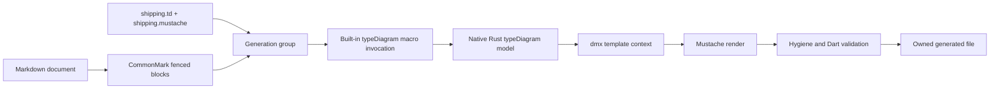

# dmx — typeDiagram Macro

Part of the [dmx specification](SPEC.md).

## [typediagram] typeDiagram Definitions plus Mustache Templates

dmx MUST generate Dart model source from typeDiagram definitions and user-authored Mustache templates:



[typeDiagram](https://typediagram.dev/docs/) supplies the model language and semantics. Mustache supplies the output shape. dmx joins them and owns parsing, validation, deterministic execution, and safe file emission. The production path MUST NOT invoke the typeDiagram CLI, library, runtime, `--to dart`, or any other typeDiagram language emitter.

There are two ways to write a definition and its templates down, and exactly one pipeline behind them. Standalone files ([typediagram.standalone]) are the plain spelling: a `.td` file, the `.mustache` files beside it, and the generated source. A Markdown document ([typediagram.documents]) keeps both inside prose that typeDiagram's own tooling still renders. Both front ends MUST produce the same generation group, and everything after binding — resolution, context, rendering, validation, emission, diagnostics, explain — MUST be shared. A front end MUST NOT introduce a second pipeline, a second context shape, or a second ownership protocol.

### [typediagram.macro] Built-in Macro

`typeDiagram` is a built-in dmx macro. Its target is a generation group rather than a Dart declaration, so it is activated by [typediagram.binding] instead of an `@dmx('typeDiagram')` annotation.

A front end MUST synthesize one immutable macro invocation per definition/template group and dispatch it through the same built-in macro registry as annotation-triggered macros. The invocation carries the typeDiagram source span, each bound template and output path, and the parsed model. The macro's Rust context builder enriches that model for Mustache; each render becomes a macro-authored whole file using the existing output branch in [dartmacros.files].

Built-in resolution, determinism, diagnostics, caching, explain output, hygiene, validation, and emission rules apply unchanged. The different trigger syntax MUST NOT create a second macro engine or bypass the shared pipeline.

### [typediagram.standalone] Standalone Definition and Template Files

A typeDiagram definition MAY be a file of its own. `<name>.td` contains typeDiagram DSL and nothing else: no front matter, no directives, no dmx metadata. It MUST remain byte-for-byte what typeDiagram's own tooling reads.

`dmx build <path>` and `dmx watch <path>` MUST accept a `.td` file explicitly, and recursive discovery MUST include every `.td` file under the paths given.

A template file is a `.mustache` file beside a definition. `<name>.mustache` is bound to `<name>.td`; `<name>.<suffix>.mustache` is bound to `<name>.td` as a second output. A template whose name matches more than one definition MUST bind to the longest match, so `shipping.wire.mustache` renders `shipping.wire.td` where one exists and `shipping.td` where it does not. Binding MUST NOT depend on anything else — not directory listing order, not a manifest, not a directive inside the definition.

A `.mustache` file with no definition beside it is not a dmx source. It MUST be left alone and MUST NOT be generated from, because a project may hold Mustache files that are nothing to do with typeDiagram.

The default output path is the target's source root, the template's name in that language's file-name casing, and the target's extension: `shipping.mustache` generates `lib/shipping.dart` and `shipping.wire.mustache` generates `lib/shipping_wire.dart`, resolved against the definition's output root ([typediagram.output]).

A template MAY override that with a leading Mustache comment on its first line:

```mustache
{{! dmx output=lib/models/shipping.dart target=dart }}
```

The comment MUST be a Mustache comment, so a template carrying one is still an ordinary template that any engine renders. Its settings are `key=value` pairs separated by whitespace rather than the JSON object a fence carries, because a Mustache comment cannot contain `}`. The keys, their meanings, their defaults, and every refusal MUST be identical to [typediagram.binding]'s: `output` and `target`, and any other key is `DMX8001`.

The definition file, not the template, is what a pass generates from: a definition always renders, through the canonical model template where nothing beside it says otherwise ([typediagram.canonical]), and the ownership marker on every output names the definition, so removing a template collects the file it used to write.

### [typediagram.canonical] The Canonical Model Template

dmx ships one model template per target, compiled into the binary. A definition with no `<name>.mustache` beside it MUST render through it, to the default output path. A `<name>.mustache` beside the definition MUST take its place; a `<name>.<suffix>.mustache` is an additional output and MUST NOT displace it. There is exactly one canonical template per target: every model class dmx generates from a diagram comes out of the same file.

For every record, and for every case of every union, it MUST write a `final class` with a `const` constructor, its fields in declaration order, and value semantics: `==`, `hashCode`, `toString`, and `copyWith`. A union MUST become a `sealed` base class its cases extend; an alias a `typedef`; a function one `typedef` per signature. Union cases are named by [typediagram.canonical.names].

Value semantics MUST be the ones `@dmx('model')` generates, built by the same code ([model.equality], [model.copywith]): collections compare by content and hash consistently with that comparison, and a nullable field's `copyWith` parameter takes a patch so that omitting it and clearing it are different calls.

`Unit` is Dart's `void`, which is not a value. A `void` member MUST take part in no comparison, no hash, and no `toString`, and a class holding one MUST NOT get a `copyWith`, because a `void` expression cannot be passed on.

**JSON MUST NOT be a member of a generated class.** A class the diagram described MUST read as what the diagram said and nothing else. `toJson` and `fromJson` MUST be written on an `extension <Name>Json on <Name>` beside it, and every generated call into another declaration's decoder MUST name that extension ([model.json-codec]). A union's extension MUST decode by reading its cases' tag under the `type` key and encode by writing it, matching what `@dmx('union')` writes when nobody names another key.

The runtime import MUST be prefixed — `import 'package:dmx/dmx.dart' as dmx;` — and every runtime name in generated code MUST carry that prefix. A diagram may declare a type called `Result`, a local declaration hides an imported name, and an unprefixed import would resolve the codec to the wrong type. The import MUST be omitted from a file that reaches nothing in the runtime.

A declaration MUST NOT be given a JSON extension when a codec cannot be built for one of its members: a type parameter, a generic declaration, an untagged union, `Unit`, or a map keyed by anything but a string. The class, its value semantics, and its `copyWith` are unaffected, and `dmx explain` MUST report `hasJson` together with the reason each refusal gave (`DMX8009`).

#### [typediagram.canonical.names] What A Union Case Is Called

A union case's class MUST be named by the case's own name — `final class Circle extends Shape` — which is what typeDiagram's own emitters name it. A diagram is a source of truth two tools generate from, and they MUST agree on what the types are called.

A case name is unique only inside its union, and a Dart library has one namespace. So a case whose name is already taken MUST take its union's name as a prefix and become `<Union><Case>` instead. A name is taken when another declaration in the same definition carries it, when another union declares a case of that name, or when it is a Dart name generated code writes itself (`bool`, `double`, `int`, `void`, `DateTime`, `Function`, `List`, `Map`, `Object`, `String`). A shared name MUST qualify on every side, so that no case is renamed by the accident of being declared second.

A case that can be called neither by its own name nor by its qualified one MUST be refused (`DMX8010`), naming both. Two classes under one name is Dart that does not compile, and a numbered suffix would be a name nobody chose.

### [typediagram.documents] Source Documents

A definition and its templates MAY instead live inside one Markdown document, which keeps the model, the templates, and the prose explaining them in a page typeDiagram's own tooling still renders.

`dmx build <path>` and `dmx watch <path>` MUST accept an explicit Markdown file. Recursive discovery MUST include files named `*.dmx.md` and MUST ignore other Markdown files unless they are passed explicitly.

dmx MUST parse Markdown with a CommonMark-compatible parser and inspect fenced-code nodes. It MUST NOT locate fences with regex. Prose, headings, links, lists, quotes, HTML, and unrelated fenced blocks are documentation and MUST remain untouched byte-for-byte.

A typeDiagram source fence uses backticks, has the ordinary upstream-compatible info string `typeDiagram`, compared case-insensitively, and contains valid typeDiagram DSL. The fence MUST remain renderable by typeDiagram's Markdown tooling; dmx-specific metadata is therefore never added to the typeDiagram fence.

### [typediagram.binding] Definition-to-Template Binding

A generation group is one definition and every template bound to it. Both front ends MUST build the same group, and it MUST remember its origin only for the purpose of naming a place in a diagnostic: a file is named, a fence is located by ordinal and line, and neither borrows the other's sentence.

Inside a Markdown document, a generation group is one typeDiagram fence followed immediately in the Markdown AST by one or more dmx-enabled Mustache fences. Blank lines do not create AST nodes and do not break the group. Any other Markdown node ends the group.

A dmx-enabled Mustache fence uses `mustache` as its language and a JSON object as the remainder of its info string. The object MUST contain `dmx.output`, an output path relative to the document's output root ([typediagram.output]), and MAY contain `dmx.target`, the name of a generation target, defaulting to `dart`. Any other key under `dmx` is an error rather than a value dmx ignores, so a misspelling is reported instead of silently generating nothing. Metadata that does not begin with `{` belongs to another convention and MUST be left alone:

```typeDiagram
type Product {
  id: String
  name: String
  price: Decimal
}
```

````markdown
## Store models

A template binds to the definition immediately above it, so the two fences are
consecutive: a heading between them would end the group.

```typeDiagram
type Product {
  id: String
  name: String
  price: Decimal
}
```

```mustache {"dmx":{"output":"lib/models/store.dart"}}
{{#declarations}}
{{#isRecord}}
final class {{name}}{{genericDeclaration}} {
  const {{name}}({{#fields}}required this.{{name}}{{comma}}{{/fields}});
{{#fields}}
  final {{{dartType}}} {{name}};
{{/fields}}
}
{{/isRecord}}
{{/declarations}}
```
````

One typeDiagram fence MAY feed several consecutive dmx-enabled Mustache fences, allowing the same model to generate several files without duplicating definitions. A typeDiagram fence with no bound dmx template remains documentation-only and MUST be ignored by dmx. A Mustache fence without `dmx` metadata is an example and MUST be ignored.

Malformed metadata, a dmx-enabled Mustache fence without an immediately preceding definition group, or two templates resolving to the same output path MUST fail the build. The last of those is a rule about bindings, not about documents, and MUST be enforced identically for standalone files. Association MUST never depend on a heading's text, fence ordinal across the document, or implicit global state.

### [typediagram.model] Model and Context

dmx MUST tokenize, parse, resolve, and validate the definition natively in Rust with typeDiagram-compatible semantics, then build one immutable context for each generation group. Production generation MUST require no Node process, npm package, `typediagram` executable, or network access. The compatibility baseline MUST be pinned and covered in development by differential fixtures against typeDiagram's public parser and versioned model JSON.

Declaration order, field order, variant order, generic parameter order, explicit discriminants, and recursively nested type arguments MUST be preserved. Unknown or unsupported type references MUST fail before rendering rather than pass through as source text.

The Mustache root contains `source`, `declarations`, and `modelVersion`. `source` contains the definition's path, the template's path where the template is a file of its own, and the one-based fence positions where they are fences. `declarations` contains each typeDiagram declaration exactly once in source order.

Every declaration exposes `kind`, `name`, `generics`, and mutually exclusive `isRecord`, `isUnion`, `isAlias`, and `isFunction` booleans. Records expose `fields`; unions expose `variants`; aliases expose `target`; functions expose `signatures`. Nested members carry `first`, `last`, and `comma` values so templates remain logic-free. Every type reference exposes its canonical typeDiagram spelling and a precomputed `dartType`; templates MUST NOT implement type resolution or Dart type mapping.

The context builder MAY add further derived strings and booleans, but it MUST NOT discard or reorder source model data. Context schema changes require a version bump and golden fixtures.

Every target-language decision MUST be confined to one generation target: the mapping from a resolved reference to that language's type text, the extension its outputs carry, and the validation a finished file passes. Nothing else in the feature — tokenizer, parser, model, binder, context builder, emitter — may name a language. A target a document names but this build does not carry is `DMX8007`.

### [typediagram.templates] Rendering

The built-in `typeDiagram` macro renders each bound Mustache body once against its group's complete context. It follows all determinism, partial-resolution, span-mapping, and no-I/O requirements in [rendering]. All target-language decisions needed by the template MUST be finished in the macro's Rust context builder; the template only selects and places prepared values.

A template failure MUST identify the definition and the template it was rendering — the two files for a standalone pair, and the document, template fence, template line, and bound typeDiagram fence for a document. Rendering one output MUST NOT mutate context observed by another output in the same group.

### [typediagram.output] Validation and Emission

An output path MUST resolve against its source's **output root**: the nearest ancestor of the definition or document that carries a project marker any target recognises — `pubspec.yaml` for Dart — bounded by the workspace, and the workspace itself when there is none. `lib/models.dart` therefore means *this package's* `lib`, so a document generates the same bytes in the same place whether dmx was run from the package, from the repository root, or from an editor that opened the whole tree.

An output path MUST normalize to a path inside that root, MUST carry the extension its target generates, and MUST NOT traverse a symbolic link outside it. Absolute paths and parent traversal are errors, and an output path equal to its own source is an error. A source is identified, in its ownership markers and its templates' contexts, by its path relative to that same root, so nothing recorded in a generated file depends on where dmx was launched.

Rendered output MUST pass the same whitespace normalization, hygiene, full-file Dart re-parse, and `dart analyze --fatal-infos` corpus gates as other generated Dart. It MUST NOT contain `throw`, casts, null assertions, or other constructs forbidden in generated Dart; that is [hygiene], enforced over the tree-sitter CST rather than over the text. The file MUST carry a dmx ownership marker containing the source path, the binding's identity — the template file for a standalone pair, the group and fence ordinals for a document — the template hash, the typeDiagram definition hash, the context version, and the dmx version. Its first line MUST be the same ownership marker whole-file emission already uses [dartmacros.files], so one predicate decides ownership for every backend that writes a file dmx owns.

Whole-file emission follows [dartmacros.files]: never overwrite an unmarked file, write atomically, avoid no-op writes, remove stale owned outputs when their template disappears, and report drift without writing under `--check`. Neither the definition nor the template is ever rewritten.

An output MUST have one live source. A target already carrying another source's ownership marker MUST be refused while that source still exists, because each pass would otherwise undo the other's. A marker naming a source that is gone identifies an orphan, and taking it over is what renaming a document is supposed to do.

### [typediagram.execution] Build, Check, Watch, and Explain

`build`, `check`, and `watch` MUST treat the definition, every bound template, and resolved partials as dependencies of every output. A change to prose outside a generation group MUST NOT invalidate its output. A semantic definition or template change MUST invalidate every dependent output.

A `.mustache` file is never generated *from*, so `watch` MUST answer an edit to one by regenerating the definition it is bound to. A watcher that only ever noticed definitions would go silent on half the edits a template author makes.

`watch` MUST retain the last valid output after an invalid edit and recover on the next valid save. `dmx explain` MUST print each group, its source spans, normalized output paths, dependency hashes, and exact context JSON without rendering or writing. It MUST accept a `.td` definition, a `.mustache` template bound to one — which explains that template's definition — and a Markdown document.

Stale collection is scoped to the roots the pass was asked to manage: an output whose ownership marker names this document, which the document no longer produces, MUST be removed (or, under `--check`, reported) when it is inside those roots.

### [typediagram.diagnostics] Diagnostics

The feature owns the `DMX8xxx` range:

| Code | Meaning |
|---|---|
| `DMX8001` | Malformed or incomplete metadata on a dmx-enabled Mustache fence or a template file's leading comment |
| `DMX8002` | dmx-enabled Mustache fence is not bound to a typeDiagram definition group |
| `DMX8003` | Two templates claim the same normalized output path |
| `DMX8004` | typeDiagram definition failed parsing, resolution, or compatibility validation |
| `DMX8005` | Output path is absolute, escapes the workspace, crosses an unsafe symlink, or is not Dart |
| `DMX8006` | Output exists without the matching dmx ownership marker |
| `DMX8007` | typeDiagram compatibility or context schema version is unsupported |
| `DMX8008` | A bound Mustache template does not compile, or its render is not source the target accepts |
| `DMX8009` | A declaration has no JSON codec, so the canonical model template writes no extension for it |
| `DMX8010` | A union case can be called neither by its own name nor by its qualified one |

Every diagnostic MUST carry the definition's path, and the fenced-block span where the definition is a fence. When applicable it also carries the typeDiagram line/column, template line/column, generated Dart line/column, and output path. A position inside a `.td` file is a position in that file: the author's editor and the diagnostic MUST agree on the line.

Rendered source that does not parse, or that breaks [hygiene], is refused by the shared diagnostics those stages already own — `DMX4001` and `DMX4003` — wrapped in a `DMX8008` that names the definition and the template that produced it. A macro name this registry serves from a Markdown group MUST NOT be reachable as an annotation: `@dmx('typeDiagram')` is `DMX2006`.
