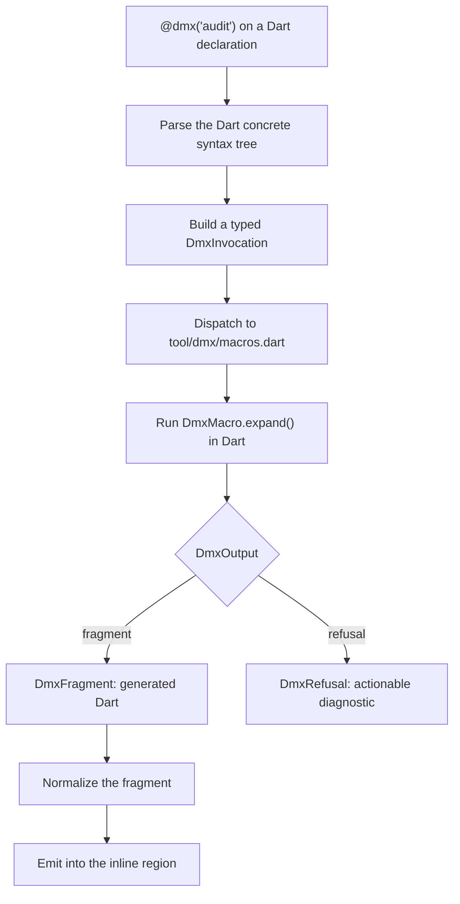

# Dart (Custom) Macros

A custom macro is a Dart program you write. dmx hands it a typed view of the
annotated declaration — the class name, its fields, their types, its
annotations — and the macro returns the Dart to emit. You walk the code
elements and write Dart from them, in Dart.

Your macro can build that Dart itself, as a string, or hand its data to a
Mustache template and let dmx render it. Either way you use the same
`@dmx('name')` annotation, and the result lands in the same region.

## Macros and templates work together

You do not choose between writing a macro and writing a template. A built-in
macro is already both: something works out what to generate, and a template
decides how it looks. A custom macro is the same, with the first half written
by you — dmx still supplies the second half.

| Your macro works out | The template decides |
| --- | --- |
| What is true — resolve a `$ref`, read a database schema, work out that a field is nullable | What it looks like — which members, in what order, with what formatting |
| Questions only your project can answer | Conventions your team wants to change without editing Dart |
| Tested like ordinary Dart | Edited like ordinary text, and readable in review |

Neither can do the other's job. A template cannot query a database. A pile of
`StringBuffer` calls is not something a teammate can safely edit when they want
a different `copyWith`.

### Which to use

- **Return Dart directly** when you are generating a few members and nobody is
  going to want them restyled. A macro that writes one getter is clearer as
  Dart than as a template plus a context.
- **Render a template** once the output gets long or repetitive, or once people
  start having opinions about how it looks — a whole class, a whole file. That
  is also the point where building strings starts hiding bugs in quotes and
  indentation.

Start with the first, and switch when you catch yourself formatting Dart inside
Dart.

## Return Dart directly

The shortest useful macro works something out and returns the Dart it wants.
It does not need a Mustache template.

```dart
final class AuditMacro extends DmxMacro {
  const AuditMacro();

  @override
  String get name => 'audit';

  @override
  Future<DmxOutput> expand(DmxInvocation invocation) async {
    final name = invocation.declaration.name;
    return DmxFragment("  /// Audit label for `$name`.\n"
        "  String get auditLabel => '$name';");
  }
}
```

`DmxFragment` takes the text and nothing else. The members land in the region
below the divider, formatted the same way the built-ins format theirs, so a
macro this short still produces output you cannot tell apart from a built-in's.

## Render a template from a macro

`invocation.templates.render` sends your data to dmx and returns the rendered
text. It is the same Mustache engine and the same formatting the built-ins use,
so your macro's output is laid out exactly like `@dmx('model')` output:

```dart
final class RowMacro extends DmxMacro {
  const RowMacro();

  @override
  String get name => 'row';

  @override
  Future<DmxOutput> expand(DmxInvocation invocation) async {
    // The macro's half: work something out that no template could.
    final columns = await readSchema(invocation.declaration.name);

    // The template's half: decide what that looks like as Dart.
    final template = File('tool/dmx/templates/row.mustache').readAsStringSync();
    return switch (await invocation.templates.render(
      template,
      {
        'className': invocation.declaration.name,
        'columns': [
          for (final column in columns)
            {'name': column.name, 'type': column.dartType},
        ],
      },
      name: 'row.mustache',
    )) {
      Ok(value: final text) => DmxFragment(text),
      Err(error: final refusal) => refusal,
    };
  }
}
```


<!-- Eleventy renders Nunjucks BEFORE markdown, and Nunjucks and Mustache share
     the `{{ }}` delimiter — so a backtick span is no protection at all, and an
     unraw'd `{{^…}}` fails the build with "expected colon after dict key". An
     HTML comment is no protection either: Nunjucks does not know what one is,
     which is why this note lives INSIDE the raw block it is explaining. Any
     Mustache shown on this site has to sit in one. -->
The context is ordinary JSON — strings, numbers, booleans, lists, and maps —
read with Mustache truthiness, so an empty list takes the `{{^…}}` branch.

Two things to know:

- **Use `{{{triple}}}` for anything containing `<`, `>`, `&`, or `"`.** A Dart
  type argument written `{{type}}` renders as `List&lt;Rate&gt;`. This is the
  same rule the built-in templates follow.

- **A template that does not compile comes back as a value**, not an
  exception — an `Err` holding a `DmxRefusal` you can return as-is.

Your macro reads the template from wherever you keep it. dmx renders it; where
it lives is up to you.

## Where the templates live

Because the template is a file your macro reads, a team can change generated
output without touching Dart:

```text
tool/dmx/
  macros.dart          the logic
  templates/
    model.mustache     the shape
    client.mustache
```

Editing `client.mustache` and saving regenerates every client the macro
authors, without anyone editing Dart.

## How a custom macro runs

The complete path is:



dmx finds your macros by convention. Run `dmx` from the package root, and if
`tool/dmx/macros.dart` is there, dmx starts one Dart process and reuses it for
the whole build or watch session. A project without that file never starts a
Dart process at all.

## Add the dmx package

One package covers both sides — the `@dmx(...)` annotation your app uses, and
the API you write macros against:

```bash
dart pub add dmx
```

They are separate libraries, so an app that only annotates its models imports
`package:dmx/dmx.dart` and never pulls in the macro machinery or its `dart:io`
use. Only `tool/dmx/macros.dart` imports `package:dmx/macros.dart`.

## Define a macro in Dart

Create `tool/dmx/macros.dart` relative to the package root:

```dart
import 'package:dmx/macros.dart';

final class AuditMacro extends DmxMacro {
  const AuditMacro();

  @override
  String get name => 'audit';

  @override
  DmxOutput expand(DmxInvocation invocation) {
    final declaration = invocation.declaration;
    if (declaration.fields.isEmpty) {
      return const DmxRefusal(
        'DMX3902',
        'The audit macro needs at least one instance field.',
      );
    }

    final entries = declaration.fields
        .map((field) => "'${field.name}': ${field.name}")
        .join(', ');
    return DmxFragment(
      '${invocation.memberIndent}Map<String, Object?> get auditEntry => '
      '{$entries};\n',
      introduced: const ['auditEntry'],
    );
  }
}

Future<void> main() => dmxServeMacros([const AuditMacro()]);
```

`dmxServeMacros` handles all the talking to dmx. You write a normal Dart class
and never deal with the protocol.

## Use the custom annotation

The consumer only sees the same annotation surface used by every built-in:

```dart
import 'package:dmx/dmx.dart';

@dmx('audit')
class Order {
  const Order({required this.id, required this.total});

  final String id;
  final int total;
}
```

Run the command from that package's root so discovery finds
`tool/dmx/macros.dart`:

```bash
dmx build lib --insert-regions
```

The returned fragment lands inside the class's machine-owned region:

```dart
@dmx('audit')
class Order {
  const Order({required this.id, required this.total});

  final String id;
  final int total;

  //#region
  Map<String, Object?> get auditEntry => {'id': id, 'total': total};
  //#endregion
}
```

No template was involved here, and none was needed: one member, a shape nobody
will want restyled. The macro inspected the fields, made a decision, and wrote
the member itself. Reach for a template when the output grows past that.

## What your macro is given

`DmxInvocation` is everything dmx read out of the source:

| Value | What is in it |
| --- | --- |
| `invocation.declaration` | Name, class/enum kind, modifiers, type parameters, superclass, interfaces, fields, and enum values |
| `declaration.fields` | Name, written type, non-null type, nullability, constructor default, and annotations |
| `invocation.args` | The custom macro's named arguments as unevaluated Dart source |
| `invocation.memberIndent` | The indentation to apply to emitted members |

`arg(label)` returns raw Dart source. `stringArg(label)` is the convenience for
a string-valued option:

```dart
@dmx('sqliteSchema', {'table': 'products'})
class ProductRow {}
```

For that annotation, `invocation.stringArg('table')` returns `products`.
Field annotations expose the same raw and string argument helpers.

## Generate, or refuse

`expand` returns one of two things:

- `DmxFragment(text, introduced: [...])` — the members to generate, plus the
  names they define.
- `DmxRefusal(code, message)` — a refusal to generate, with an error message
  that tells the reader what to do about it.

Refusing is returning a value, not throwing. Refuse whenever you cannot
generate something correct: a wrong guess becomes a bug in every caller.

```dart
return switch (invocation.declaration.kind) {
  'class' => DmxFragment(
      '${invocation.memberIndent}String get generatedBy => \'dmx\';\n',
      introduced: const ['generatedBy'],
    ),
  _ => const DmxRefusal(
      'DMX3903',
      'This macro can only target a class.',
    ),
};
```

## Two worked examples

The repository ships two, one on each side of the choice above.

**[SQLite](https://github.com/Nimblesite/dmx/tree/main/examples/dmx_sqlite_example)
— a macro that builds its Dart directly.** It reads a live database schema,
derives tables from annotated class names, and generates fields, constructors,
SQL statements, and row mappers. One annotated class produces one file per
table.

**[OpenAPI](https://github.com/Nimblesite/dmx/tree/main/examples/dmx_openapi_example)
— the same idea, with the shape in templates.** It reads a vendored OpenAPI
document and writes a typed client plus a data class per schema. The macro
resolves `$ref`s, chooses Dart types, works out nullability, and names classes
the document never named — the `providers` array in a response has no name
anywhere, so the macro calls it `RateProvider`. Then it hands all of that to
`templates/model.mustache` and `templates/client.mustache` and lets dmx render
it.

Change `client.mustache` and every generated method changes shape; change the
document and the method list changes. The example's tests run the generated
client against the real API.

Neither example is a built-in with a different template. Both read data that
only that project has — a database schema, an API document — and turn it into
Dart.

Keep those inputs deterministic and available in CI. Generated source should
be reproducible from committed source and declared project assets — which is
why the OpenAPI example vendors the document rather than fetching it.

## Compose custom and built-in macros

Your macro names sit alongside the built-in ones. You cannot reuse a built-in
name — doing so fails with `DMX7005` — and two macros with the same name fail
with `DMX7006`.

You can put your own macro on a class next to a built-in:

```dart
@dmx('model')
@dmx('audit')
class Order {
  const Order({required this.id});

  final String id;
}
```

Both write into the same region, in the order you wrote the annotations.

## What works today

- dmx finds `tool/dmx/macros.dart` on its own;
- the typed `package:dmx/macros.dart` API;
- one Dart process, started once and reused;
- the class, its fields, their annotations, and your macro's arguments as input;
- generating members, authoring whole files, and refusing;
- errors for reusing a built-in name or declaring the same name twice;
- rendering a Mustache template from your macro, through dmx's own engine; and
- the SQLite and OpenAPI examples above, with tests.

Your macro currently sees the class as dmx parsed it, not the analyzer's full
picture of your program, so there is no type inference to lean on yet. That,
`dmx explain`, and faster macro startup are tracked in the
[implementation plan](https://github.com/Nimblesite/dmx/blob/main/docs/plans/PLAN.md).

The implementation lives in the
[`dmx` Dart package](https://github.com/Nimblesite/dmx/blob/main/src/dart_packages/dmx/lib/macros.dart)
and the
[`dartmacros` Rust driver](https://github.com/Nimblesite/dmx/blob/main/src/dmx/src/dartmacros.rs).
