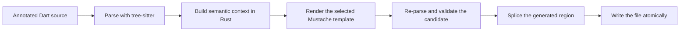

# Pipeline

Every save takes the same six steps, whether the code comes from a built-in
macro, your Mustache template, or a macro you wrote in Dart:

## Parse

tree-sitter parses your Dart. The `//#region` markers are found as real comments, so the same text inside a string literal is never mistaken for one.

## Build context

dmx works out every decode, encode, equality, hash, copy and validation expression before any template runs. The template is handed finished strings, so it never has to reason about Dart types — which is what makes templates safe to edit.

## Render

The Mustache template decides what the generated code looks like. Because the hard work is already done, swapping in your own template changes the shape of the output without changing what it means.

## Validate

dmx parses the whole finished file, not just the part it generated. If that fails you get an error message and your file is left exactly as it was.

## Emit

dmx checks that everything outside the generated region is unchanged, writes the new code into the region, skips the write entirely if nothing changed, and replaces the file in one step.

Only a bare `//#region` … `//#endregion` block belongs to dmx. Put a label on one — `//#region Helpers` — and it is yours; dmx will not write into it.

The [normative specification](https://github.com/Nimblesite/dmx/blob/main/docs/specs/SPEC.md) defines each stage and its diagnostics.
